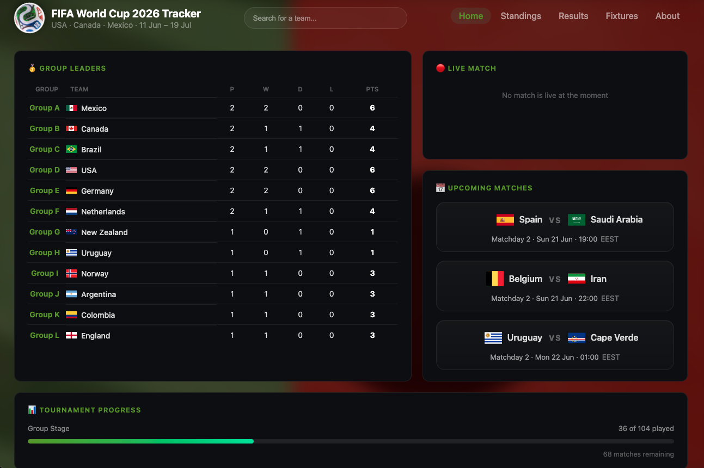

# ⚽ FIFA World Cup 2026 Tracker

A real-time World Cup 2026 dashboard built with React, TypeScript and Vite.
Live data powered by the [football-data.org](https://www.football-data.org) API.

## 🚀 Live Demo
[worldcup2026-tracker-app.vercel.app](https://worldcup2026-tracker-app.vercel.app) 

<div>

</div>

## ✨ Features

### 🏠 Home Dashboard
- 🥇 **Group Leaderboard** — quick snapshot of the top team in each of the 12 groups
- 🔴 **Live Match** — shows the current live match with real-time score, or a "no match live" message
- 📅 **Upcoming Matches** — next fixtures with date, time and timezone (EEST)
- 🥅 **Top Scorers** — live scorer rankings for WC 2026
- ⚽ **Latest Results** — most recent match scores at a glance
- 📊 **Tournament Progress** — matches played vs remaining with a progress bar
- 📸 **Image Carousel** — WC 2026 venues and highlights

### 📄 Pages
- 🏆 **Standings** — full group tables for all 12 groups with P, W, D, L, GD and PTS
- 🕐 **Results** — all match scores filterable by matchday
- 🗓️ **Fixtures** — upcoming matches with date, time and venue
- 🔍 **Team Search** — search any of the 48 teams and view their details
- 🌍 **About** — tournament info, fun facts and external resources

## 🛠️ Tech Stack

| Tool | Purpose |
|------|---------|
| React 18 | UI framework |
| TypeScript | Type safety |
| Vite | Build tool & dev server |
| React Router v6 | Client-side routing |
| football-data.org API | Live match data |
| Vitest | Unit testing |
| Vercel | Deployment |

## 📦 Getting Started

### Prerequisites
- Node.js 18+
- A free API key from [football-data.org](https://www.football-data.org)

### Installation

```bash
git clone https://github.com/mareerray/worldcup2026-tracker.git
cd worldcup2026-tracker
npm install
```

### Environment Variables

Create a `.env` file at the root:

```env
VITE_API_KEY=your_api_key_here
```

### Run locally

```bash
npm run dev
```

### Run tests

```bash
npm run test
```

### Build for production

```bash
npm run build
```

## 📁 Project Structure
````
src/
├── components/
│   ├── Footer.tsx          # Footer with credits
│   ├── GroupTable.tsx      # Group standings table component
│   ├── Header.tsx          # Sticky header with search & nav
│   ├── MatchCard.tsx       # Reusable match result/fixture card
│   ├── Navbar.tsx          # Navigation tab bar
│   └── SearchBar.tsx       # Team search with dropdown
├── pages/
│   ├── About.tsx           # Tournament info, facts & resources
│   ├── Fixtures.tsx        # Upcoming matches with date/time/venue
│   ├── Home.tsx            # Dashboard: live, upcoming & standings
│   ├── Results.tsx         # Match history filterable by matchday
│   ├── Standings.tsx       # All 12 group tables
│   └── TeamPage.tsx        # Individual team detail page
├── styles/
│   ├── About.css           # About page styles
│   ├── Footer.css          # Footer styles
│   ├── Home.css            # Home dashboard styles
│   ├── index.css           # Global styles & CSS variables
│   ├── SearchBar.css       # Search component styles
│   └── TeamPage.css        # Team page styles
├── types/
│   └── index.ts            # TypeScript interfaces & types
├── App.tsx                 # Root component with routing
└── main.tsx                # App entry point
````

## 🔑 API

This project uses the free tier of [football-data.org](https://www.football-data.org).  
Rate limit: 10 requests/minute.

---

Built by [Mayuree Reunsati](https://github.com/mareerray) · grit:lab Åland June 2026

