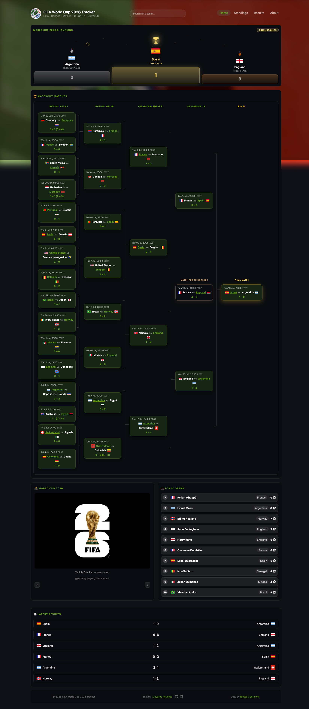

# ⚽ FIFA World Cup 2026 Tracker

A World Cup 2026 tournament dashboard built with React, TypeScript and Vite.

Match, team and scorer data is stored in **Supabase Postgres** and read through SQL views. The app also uses the [football-data.org](https://www.football-data.org) API for pages that have not yet been migrated to Supabase.

## 🚀 Live Demo

[worldcup2026-tracker-app.vercel.app](https://worldcup2026-tracker-app.vercel.app)

<div>
  
</div>

## ✨ Features

### 🏠 Home Dashboard

- 🏆 **Knockout Bracket** — full tournament tree from the Round of 32 to the Final, including the third-place match
- 🥅 **Top Scorers** — top 10 scorer rankings with team crests and names
- ⚽ **Latest Results** — the six most recent completed matches
- 📸 **Image Carousel** — World Cup 2026 venues and highlights

### 📄 Pages

- 🏆 **Standings** — group tables for all 12 groups with P, W, D, L, GD and PTS
- 🕐 **Results** — group-stage results by matchday and every knockout stage
- 🗓️ **Fixtures** — fixture list with date, time and venue
- 🔍 **Team Search** — search all 48 teams and view their tournament results, next match, scorers and status badge
- 🌍 **About** — tournament information, fun facts and external resources

### ⚽ Score handling

- Penalty shootout goals are separated from the in-play score.
- For example, a game stored as `4–5` after a `1–1` draw and a shootout is displayed as `1–1 (3–4 pens)`.
- Extra-time goals remain part of the displayed in-play score.

## 🗄️ Data Architecture

| Table / view | Purpose |
|---|---|
| `teams` | Team id, name, short name, TLA and crest URL |
| `matches` | Tournament match records and score fields |
| `scorers` | Player goal totals |
| `match_details` | View joining matches with home and away team details, plus derived `winner_team_id` |
| `scorer_details` | View joining scorers with team metadata and crest |

### Match results view

`match_details` provides a frontend-friendly match row by joining `matches` with `teams`.

Its `winner_team_id` is derived in SQL:

- A finished normal-time or extra-time game uses the final in-play score.
- A penalty shootout uses the penalty score.
- A drawn group-stage game has no winner.

The group stage contains 72 games: 52 have a winner and 20 are draws.

### Adapter layer

`src/lib/matches.ts` maps Supabase rows to the existing frontend `Match` type through `toMatch()`.

This preserves the existing `MatchCard` and `formatScore` components while moving queries from the football-data API to Supabase.

### Data limitations

The free football-data.org plan does not include squad and coach data from `/teams/{id}`. Therefore, the Team page intentionally hides Formation, Coach and Squad sections rather than showing unavailable or empty data.

## 🛠️ Tech Stack

| Tool | Purpose |
|---|---|
| React 19 | UI framework |
| TypeScript | Type safety |
| Vite | Build tool and development server |
| React Router v7 | Client-side routing |
| Supabase Postgres | Tournament database and browser data API |
| football-data.org API | Remaining live football data |
| Vitest | Unit testing |
| Vercel | Deployment and football-data proxy |

## 📦 Getting Started

### Prerequisites

- Node.js 18+
- A Supabase project with the required tables, views and read policies
- A football-data.org API key for pages that still use its API

### Installation

```bash
git clone https://github.com/mareerray/worldcup2026-tracker.git
cd worldcup2026-tracker
npm install
```

### Environment Variables

Create a `.env` file in the project root:

```env
# Used by the Vite development proxy for football-data.org
FOOTBALL_API_KEY=your_football_data_api_key

# Public Supabase project credentials, used by the browser client
VITE_SUPABASE_URL=your_supabase_project_url
VITE_SUPABASE_ANON_KEY=your_supabase_anon_key
```

| Variable | Used by | Notes |
|---|---|---|
| `FOOTBALL_API_KEY` | Local Vite proxy | Sent as `X-Auth-Token` to football-data.org |
| `VITE_SUPABASE_URL` | Supabase browser client | Safe to expose; identifies the Supabase project |
| `VITE_SUPABASE_ANON_KEY` | Supabase browser client | Safe to expose only with correct Row Level Security policies |

> **Note:** Restart the dev server after changing `.env`. Never commit `.env` to Git.

For production, set the football-data key and Supabase variables in **Vercel → Project → Settings → Environment Variables**.

### Run locally

```bash
npm run dev
```

### Run tests

```bash
npm run test
```

### Build for production

```bash
npm run build
```

## 📁 Project Structure

```text
.
├── README.md
├── index.html
├── package.json
├── tsconfig.json
├── tsconfig.app.json
├── tsconfig.node.json
├── vite.config.ts
├── vitest.config.ts
├── vercel.json
├── api/
│   └── football.ts                 # Vercel proxy → football-data.org
├── public/
│   └── images/                     # Screenshots and image assets
└── src/
    ├── App.tsx
    ├── main.tsx
    ├── api/
    │   └── footballClient.ts       # Browser helper for /api/football
    ├── components/
    │   ├── ChampionsPodium.tsx
    │   ├── Footer.tsx
    │   ├── GroupTable.tsx
    │   ├── Header.tsx
    │   ├── KnockoutBracket.tsx
    │   ├── MatchCard.tsx
    │   ├── Navbar.tsx
    │   └── SearchBar.tsx
    ├── lib/
    │   ├── matches.ts              # Supabase match, scorer and team queries
    │   └── supabase.ts             # Supabase client
    ├── pages/
    │   ├── About.tsx
    │   ├── Fixtures.tsx
    │   ├── Home.tsx
    │   ├── Results.tsx
    │   ├── Standings.tsx
    │   └── TeamPage.tsx
    ├── styles/
    │   └── ...
    ├── types/
    │   ├── db.ts                   # Supabase row types
    │   └── index.ts                # Frontend types
    └── utils/
        ├── formatScore.ts
        └── slides.ts
```

## 🔑 Data Sources

### Supabase

Supabase powers the Home dashboard, Results page and Team page through browser-readable views and tables.

- `match_details` supplies match lists, knockout bracket data, latest results and team match history.
- `scorer_details` supplies the Home top-scorers list and each team's scorers.
- `teams` supplies team identity data for Team pages.

### football-data.org

The project uses the football-data.org free tier for data that has not yet been migrated to Supabase.

- **Local development:** Vite proxies `/api/football/*` to football-data.org.
- **Production:** Vercel runs `api/football.ts` as a serverless proxy.
- Free-tier rate limit: approximately 10 calls per minute.

## License

This project is for educational and portfolio purposes.

---

Built by [Mayuree Reunsati](https://github.com/mareerray) · grit:lab Åland · June - October 2026