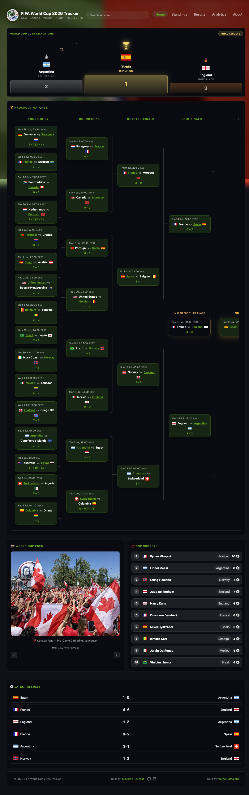

# ⚽ FIFA World Cup 2026 Tracker

A World Cup 2026 tournament dashboard built with React, TypeScript and Vite.

Match, team, scorer and analytics data is stored in **Supabase Postgres** and read through SQL views. The app also uses the [football-data.org](https://www.football-data.org) API for pages that have not yet been migrated to Supabase.

## 📚 Table of Contents

- [Live Demo](#-live-demo)
- [Features](#-features)
  - [Home Dashboard](#-home-dashboard)
  - [Analytics](#-analytics)
  - [Pages](#-pages)
  - [Score Handling](#-score-handling)
- [Data Architecture](#️-data-architecture)
  - [Match Results View](#match-results-view)
  - [Analytics Views](#analytics-views)
  - [Adapter Layer](#adapter-layer)
  - [Data Limitations](#data-limitations)
  - [Planned Analytics Improvement](#planned-analytics-improvement)
- [Tech Stack](#️-tech-stack)
- [Getting Started](#-getting-started)
  - [Prerequisites](#prerequisites)
  - [Installation](#installation)
  - [Environment Variables](#environment-variables)
  - [Run Locally](#run-locally)
  - [Run Tests](#run-tests)
  - [Build for Production](#build-for-production)
- [Project Structure](#-project-structure)
- [Data Sources](#-data-sources)
  - [Supabase](#supabase)
  - [football-data.org](#football-dataorg)
- [License](#license)

## 🚀 Live Demo

[worldcup2026-tracker-app.vercel.app](https://worldcup2026-tracker-app.vercel.app)

<div>
  
</div>

[↑ Back to contents](#-table-of-contents)

## ✨ Features

### 🏠 Home Dashboard

- 🏆 **Knockout Bracket** — full tournament tree from the Round of 32 to the Final, including the third-place match
- 🥅 **Top Scorers** — top 10 scorer rankings with team crests and names
- ⚽ **Latest Results** — the six most recent completed matches
- 📸 **Image Carousel** — World Cup 2026 venues and highlights

### 📊 Analytics

- 📌 **Tournament Overview** — KPI cards for finished matches, in-play goals, goals per match, penalty shootouts and draws after play
- 📋 **Scoring by Stage** — tournament-stage table with matches, goals, goals per match, penalty shootouts and draws
- ⚔️ **Team Performance** — side-by-side charts for top attacks by goals scored and best defences by fewest goals conceded
- 📈 **Team Statistics** — sortable team table with performance rank, matches played, goals for, goals against, goal difference and goals per match
- ⚽ **Highest-Scoring Matches** — football-themed lollipop ranking of the top 10 completed matches by in-play goals, including match date and tournament stage

### 📄 Pages

- 🏆 **Standings** — group tables for all 12 groups with P, W, D, L, GD and PTS
- 🕐 **Results** — group-stage results by matchday and every knockout stage
- 🗓️ **Fixtures** — fixture list with date, time and venue
- 📊 **Analytics** — tournament, stage, team and high-scoring-match insights
- 🔍 **Team Search** — search all 48 teams and view their tournament results, next match, scorers and status badge
- 🌍 **About** — tournament information, fun facts and external resources

### ⚽ Score handling

- Penalty-shootout kicks are separated from the in-play score.
- For example, a game stored as `4–5` after a `1–1` draw and a shootout is displayed as `1–1 (3–4 pens)`.
- Extra-time goals remain part of the displayed in-play score.
- Analytics ranking and goals-based metrics use **in-play goals only**, excluding penalty-shootout kicks.

[↑ Back to contents](#-table-of-contents)

## 🗄️ Data Architecture

| Table / view | Purpose |
|---|---|
| `teams` | Team id, name, short name, TLA and crest URL |
| `matches` | Tournament match records and stored score fields |
| `scorers` | Player goal totals |
| `match_details` | View joining matches with home and away team details, plus derived `winner_team_id` |
| `scorer_details` | View joining scorers with team metadata and crest |
| `match_analytics` | Analytics-ready match view with normalised in-play goal fields |
| `tournament_overview` | One tournament-level summary row for overview KPI cards |
| `stage_analytics` | One analytics row per tournament stage |
| `team_performance` | One all-matches performance row per team |
| `highest_scoring_matches` | Top 10 finished matches ranked by total in-play goals |

### Match results view

`match_details` provides a frontend-friendly match row by joining `matches` with `teams`.

Its `winner_team_id` is derived in SQL:

- A finished normal-time or extra-time game uses the final in-play score.
- A penalty shootout uses the penalty score.
- A drawn group-stage game has no winner.

The group stage contains 72 games: 52 have a winner and 20 are draws.

[↑ Back to contents](#-table-of-contents)

### Analytics views

The analytics feature is based on a view pipeline:

```text
matches
  ↓
match_analytics
  ├── tournament_overview
  ├── stage_analytics
  ├── team_performance
  └── highest_scoring_matches
```

`match_analytics` normalises goal data so that penalty-shootout kicks do not inflate scoring totals.

```text
home_goals_in_play
away_goals_in_play
total_goals_in_play
```

#### Tournament overview

`tournament_overview` returns one summary row for the Analytics overview cards:

| Metric | Meaning |
|---|---|
| `finished_matches` | Completed matches in the dataset |
| `goals_in_play` | Goals excluding penalty-shootout kicks |
| `goals_per_match` | In-play goals divided by finished matches |
| `penalty_shootouts` | Matches decided by a shootout |
| `draws_after_play` | Matches level after normal or extra time, before a shootout |

#### Stage analytics

`stage_analytics` returns one row per tournament stage:

```text
stage
finished_matches
goals_in_play
goals_per_match
penalty_shootouts
draws_after_play
```

The UI displays stages as a table rather than a bar chart because stages contain very different numbers of matches. Showing match counts beside goal totals and averages gives the necessary context.

#### Team performance

`team_performance` returns one combined all-matches row per team:

```text
performance_rank
team_id
team_name
short_name
tla
crest_url
matches_played
goals_scored
goals_conceded
goal_difference
goals_per_match
```

`performance_rank` is calculated in SQL using:

```text
1. Goal difference, highest first
2. Goals scored, highest first
3. Goals conceded, lowest first
4. Team name, A–Z, as a stable final tie-breaker
```

The Analytics table can change its visible row order without changing the stored performance rank.

#### Highest-scoring matches

`highest_scoring_matches` returns the top 10 completed matches ordered by `total_goals_in_play`.

It includes match date, stage, duration, home and away team data, in-play scores, total in-play goals and penalty-shootout scores for context.

The Analytics page uses a football-themed lollipop visual with a fixed 0–10 goal scale. Penalty kicks do not affect the match rank or displayed total-goals value.

[↑ Back to contents](#-table-of-contents)

### Adapter layer

`src/lib/matches.ts` maps Supabase rows to the existing frontend `Match` type through `toMatch()`.

This preserves the existing `MatchCard` and `formatScore` components while moving queries from the football-data API to Supabase.

`src/lib/analytics.ts` provides typed Supabase fetch functions for the four Analytics views.

### Data limitations

The free football-data.org plan does not include squad and coach data from `/teams/{id}`. Therefore, the Team page intentionally hides Formation, Coach and Squad sections rather than showing unavailable or empty data.

### Planned analytics improvement

The current `team_performance` view combines group-stage and knockout matches.

A future `team_performance_knockout` view will provide the same metrics for matches where the stage is not `GROUP_STAGE`. This will allow the Analytics page to switch between:

```text
All teams
→ Group-stage and knockout matches combined.

Knockout only
→ Knockout-stage matches only.
```

When available, the selected dataset will update the Team Statistics table, Top Attacks chart, Best Defences chart and calculated performance ranks together.


## 🛠️ Tech Stack

| Tool | Purpose |
|---|---|
| React 19 | UI framework |
| TypeScript | Type safety |
| Vite | Build tool and development server |
| React Router v7 | Client-side routing |
| Supabase Postgres | Tournament database and browser data API |
| football-data.org API | Remaining live football data |
| Vitest | Unit testing |
| Vercel | Deployment and football-data proxy |

[↑ Back to contents](#-table-of-contents)

## 📦 Getting Started

### Prerequisites

- Node.js 18+
- A Supabase project with the required tables, views and read policies
- A football-data.org API key for pages that still use its API

### Installation

```bash
git clone [https://github.com/mareerray/worldcup2026-tracker.git](https://github.com/mareerray/worldcup2026-tracker.git)
cd worldcup2026-tracker
npm install
```

### Environment Variables

Create a `.env` file in the project root:

```env
# Used by the Vite development proxy for football-data.org
FOOTBALL_API_KEY=your_football_data_api_key

# Public Supabase project credentials, used by the browser client
VITE_SUPABASE_URL=your_supabase_project_url
VITE_SUPABASE_PUBLISHABLE_KEY=your_supabase_publishable_key
```

| Variable | Used by | Notes |
|---|---|---|
| `FOOTBALL_API_KEY` | Local Vite proxy | Sent as `X-Auth-Token` to football-data.org |
| `VITE_SUPABASE_URL` | Supabase browser client | Safe to expose; identifies the Supabase project |
| `VITE_SUPABASE_PUBLISHABLE_KEY` | Supabase browser client | Safe to expose only with correct Row Level Security policies |

> **Note:** Restart the development server after changing `.env`. Never commit `.env` to Git.

For production, set the football-data key and Supabase variables in **Vercel → Project → Settings → Environment Variables**.

### Run locally

```bash
npm run dev
```

### Run tests

```bash
npm run test
```

### Build for production

```bash
npm run build
```

[↑ Back to contents](#-table-of-contents)

## 📁 Project Structure

```text
.
├── README.md
├── API_ENDPOINTS.md
├── index.html
├── package.json
├── tsconfig.json
├── tsconfig.app.json
├── tsconfig.node.json
├── vite.config.ts
├── vitest.config.ts
├── vercel.json
├── api/
│   └── football.ts                 # Vercel proxy → football-data.org
├── public/
│   └── images/                     # Screenshots and image assets
└── src/
    ├── App.tsx
    ├── main.tsx
    ├── api/
    │   └── footballClient.ts       # Browser helper for /api/football
    ├── components/
    │   ├── ChampionsPodium.tsx
    │   ├── Footer.tsx
    │   ├── GroupTable.tsx
    │   ├── Header.tsx
    │   ├── KnockoutBracket.tsx
    │   ├── MatchCard.tsx
    │   ├── Navbar.tsx
    │   └── SearchBar.tsx
    ├── lib/
    │   ├── analytics.ts            # Typed Supabase analytics-view queries
    │   ├── matches.ts              # Supabase match, scorer and team queries
    │   └── supabase.ts             # Shared Supabase client
    ├── pages/
    │   ├── About.tsx
    │   ├── Analytics.tsx
    │   ├── Fixtures.tsx
    │   ├── Home.tsx
    │   ├── Results.tsx
    │   ├── Standings.tsx
    │   └── TeamPage.tsx
    ├── styles/
    │   ├── Analytics.css
    │   └── ...
    ├── types/
    │   ├── analytics.ts            # Analytics-view row types
    │   ├── db.ts                   # Supabase row types
    │   └── index.ts                # Frontend types
    └── utils/
        ├── formatScore.ts
        └── slides.ts
```

[↑ Back to contents](#-table-of-contents)

## 🔑 Data Sources

### Supabase

Supabase powers the Home dashboard, Results page, Team page and Analytics page through browser-readable tables and views.

- `match_details` supplies match lists, knockout bracket data, latest results and team match history.
- `scorer_details` supplies the Home top-scorers list and each team’s scorers.
- `teams` supplies team identity data for Team pages.
- `match_analytics` supplies normalised in-play goal data for analytics.
- `tournament_overview`, `stage_analytics`, `team_performance` and `highest_scoring_matches` supply the Analytics dashboard.

### football-data.org

The project uses the football-data.org free tier for data that has not yet been migrated to Supabase.

- **Local development:** Vite proxies `/api/football/*` to football-data.org.
- **Production:** Vercel runs `api/football.ts` as a serverless proxy.
- Free-tier rate limit: approximately 10 calls per minute.

[↑ Back to contents](#-table-of-contents)

## License

This project is for educational and portfolio purposes.

---

Built by [Mayuree Reunsati](https://github.com/mareerray) · grit:lab Åland · June–October 2026